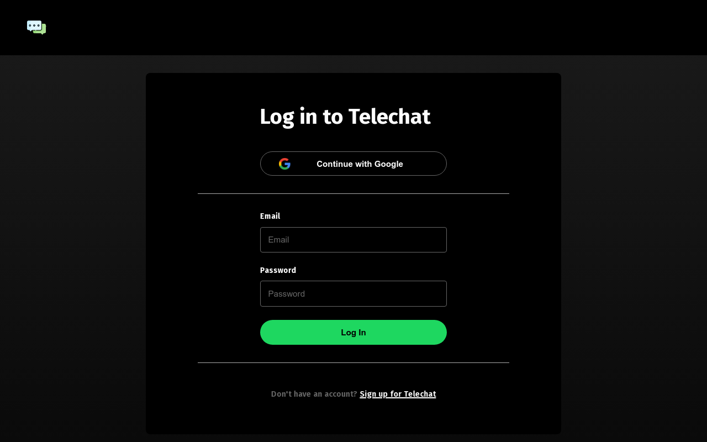

# Telechat (A Realtime Chat App)



## Table of Contents

- [About](#about)
- [Features](#features)
- [Contact](#contact)
- [Social](#social)
- [Setup](#setup)

## About

Telechat is a real-time chat application designed to revolutionize your communication experience. Powered by Firebase, it delivers instant messaging that keeps you connected seamlessly. Whether you're chatting with friends, collaborating with colleagues, or staying in touch with loved ones, Telechat ensures lightning-fast communication with an intuitive interface.

## Features

- **Realtime Chat Messaging**: Engage in instant and seamless chat conversations powered by Firebase for real-time communication.

- **User Authentication**: Users can securely log in with their email or Google accounts, ensuring a hassle-free onboarding experience.

- **Interactive Sidebar**: Effortlessly manage your contacts and ongoing chats with an interactive sidebar. Search for contacts and add them to your list just like Telegram.

- **Realtime Message Updates**: Stay updated with the latest messages in an interactive chat screen. Send and receive text messages in real-time.

- **Image Sharing**: Express yourself visually by sending images along with text messages. Share moments and experiences with ease.

- **Cross-Device Compatibility**: Enjoy a consistent and responsive chat experience across various devices, ensuring you stay connected wherever you go.

- **User-Friendly Design**: Navigate the app effortlessly with an intuitive and user-friendly design that enhances your chatting experience.


## Contact

Feel free to reach out to me with any inquiries, opportunities, or collaborations. You can contact me at:

- Email: [priyanshusharma0326@gmail.com](mailto:priyanshusharma0326@gmail.com)
- LinkedIn: [Priyanshu Sharma](https://www.linkedin.com/in/priyanshusharma0326)
- Portfolio: [portfolio-xtechilad.vercel.app](https://portfolio-xtechilad.vercel.app/)

## Social

Connect with me on social media:

- Twitter: [@xtechilad](https://twitter.com/xtechilad)
- Instagram: [@xtechilad](https://www.instagram.com/xtechilad)
- GitHub: [@priyanshusharma0326](https://github.com/priyanshusharma0326)

Let's engage, share ideas, and stay connected!

## Setup

Clone the project

```bash
  git clone https://github.com/PriyanshuSharma0326/telechat.git
```

Go to the project directory

```bash
  cd telechat/
```

Install dependencies

```bash
  npm i react
  npm i react-dom
  npm i react-router-dom
  npm i firebase
  npm i react-scripts
  npm i react-spinners
  npm i uuid
  npm i web-vitals
  npm i @emotion/react
  npm i @emotion/styled
  npm i @mui/icons-material
  npm i @mui/material
  npm i -D sass
```

Start the server

```bash
  npm start
```
### Environment Variables

To run this project, you will need to add the following environment variables to your .env file

`REACT_APP_API_KEY=YOUR_API_KEY`

`REACT_APP_AUTH_DOMAIN=YOUR_AUTH_DOMAIN`

`REACT_APP_PROJECT_ID=YOUR_PROJECT_ID`

`REACT_APP_STORAGE_BUCKET=YOUR_STORAGE_BUCKET`

`REACT_APP_SENDER_ID=YOUR_SENDER_ID`

`REACT_APP_APP_ID=YOUR_APP_ID`


### Tech Stack

**Client:** React, context API, SASS, Material UI, Firebase, Firebase Authentication, React Router


### Deployment

Deploy this project on Vercel.